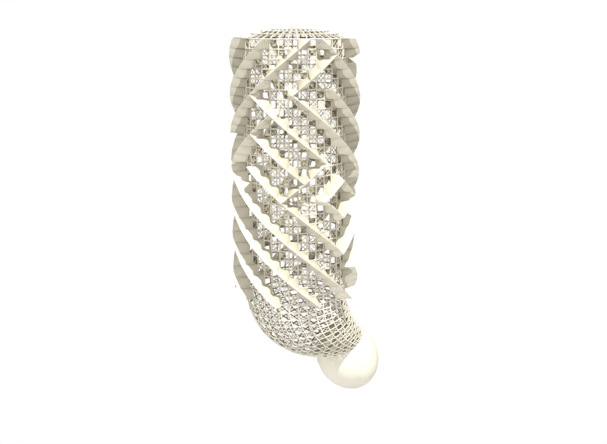
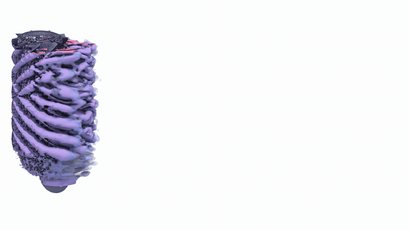
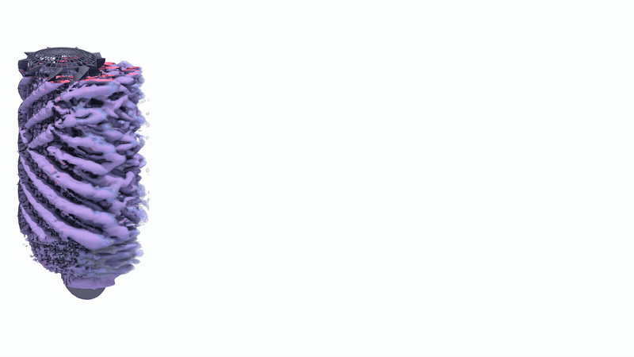

# sponge

Flow past a sponge, a porous cylindrical lattice (parameters in
[geom/README.md](geom/README.md)), simulated with
[Basilisk](http://basilisk.fr). The sponge geometry is an STL file
converted to a Basilisk dump, which the solver
[cylinder/cylinder.c](cylinder/cylinder.c) restores with `-d`. The
solver also has analytic shapes (`-S cylinder`, `-S sphere`) used for
validation.

[](real.stl)

[real.stl](real.stl): the scanned sponge, centred and scaled to unit
diameter by [stl/center.py](stl/center.py).





Q criterion at four levels, Re 2000 above and Re 4000 below, every
sixth frame of the runs described under [Render](#render).

Files:

- [geom/gen.py](geom/gen.py): sponge parameters (`config.py`) to `ver.stl`
- [stl/center.py](stl/center.py): center the STL, scale the diameter to 1, axis along z
- [stl/size.py](stl/size.py): print z extent of an STL
- [dump/stl2dump.c](dump/stl2dump.c): STL to Basilisk dump, `-w z LEVEL Z0 Z1` adds walls at the sponge ends
- [dump/dump2xdmf.c](dump/dump2xdmf.c): dump to XDMF for ParaView
- [cylinder/cylinder.c](cylinder/cylinder.c): solver, `cylinder -h` lists options
- [cylinder/deploy/cylinder.c](cylinder/deploy/cylinder.c): preprocessed solver source, needs only mpicc
- [geom/0pre.sh](geom/0pre.sh), [geom/0run.sh](geom/0run.sh): SLURM scripts used for production runs

## Install

Requires MPI, GNU make, Python 3 with numpy and scipy.

```sh
wget -q http://basilisk.fr/basilisk/basilisk.tar.gz
tar zxf basilisk.tar.gz
cd basilisk/src
cp config.gcc config    # macOS: cp config.osx config
(MAKEFLAGS=-j`nproc`; make ast && make qcc)
mkdir -p "$HOME/.local/bin" && cp qcc "$HOME/.local/bin/"
```

The path to basilisk/src is compiled into qcc, do not move the
directory after building.

```sh
(cd cylinder && make cylinder)
(cd dump && make stl2dump dump2xdmf)
```

On macOS use `make cylinder QCCFLAGS=-D_DARWIN_C_SOURCE` and
`make stl2dump dump2xdmf CC=gcc-15` (Homebrew gcc, for OpenMP).

## Run

```sh
mkdir sponge0 && cd sponge0
cat > config.py <<'EOF'
NV = 20
NC = 30
AA = 0.25
BB = 0.5
LOOP_NO = 1
R_E = 1.2
NumBelix = 1
NumBelix2 = 0
EOF
PYTHONPATH=. python3 ../geom/gen.py
../stl/center.py -v ver.stl center.stl
set -- $(../stl/size.py center.stl)
../dump/stl2dump -v -o -w z 6 $1 $2 -- -5 -6.25 -6.25 12.5  4 7  4 center.stl basilisk.dump
mpiexec -n 4 ../cylinder/cylinder -v -F -r 100 -p 100 -e 200 -Z $2 \
        -f force.dat -d basilisk.dump -o h -b pp
```

stl2dump arguments: `X0 Y0 Z0 L minlevel maxlevel npe file.stl
out.dump`. The mesh is fixed by stl2dump and does not change during
the run: minlevel everywhere (with `-o` the last 10% of the domain in
x is coarser), maxlevel at the sponge surface, LEVEL at the walls.
The wake is resolved at minlevel. Production runs use levels 10 13,
see [geom/0pre.sh](geom/0pre.sh).

Output: `force.dat` (columns: step, t, dt, total force, pressure force,
viscous force, three components each), `h.N.xdmf2` full field (with
`-F`), `h.y.N.xdmf2` and `h.z.N.xdmf2` slices for ParaView, `h.N.dump`
restart files (restart with `-d h.N.dump -i`). Cell attributes in
`h.N.attr.raw`: p, lambda2, Q, u (3), omega (3); the slices also have
cs and phi after Q.

## Render

Iso-surfaces of |omega| (or the Q criterion with `qVALUE`, lambda2
with `lVALUE`) from the full-field
output (`-F`), extracted with
[amriso](https://github.com/cselab/amriso)
(`pip install git+https://github.com/cselab/amriso`) and rendered with
ParaView. The sponge surface comes from the STL. `-Z ZCUT` drops
cells with |z| > ZCUT, to hide the boundary layers on the end walls.
`-X XCUT` and `-Y YCUT` keep the surface inside the refined wake box
and upstream of the outlet coarsening; without them the coarse far
field contributes large flat facets.

```sh
python3 ../tool/iso.py -Z 1.6 1 h.[0-9]*.xdmf2
pvpython ../tool/pvsurf.py 1 center.stl h.[0-9]*.xdmf2
ffmpeg -framerate 4 -pattern_type glob -i 'h.*.omega1.png' -pix_fmt yuv420p omega1.mp4
```

[tool/iso.py](tool/iso.py) writes `h.N.omega1.xdmf2` triangle meshes
colored by omega_z, [tool/pvsurf.py](tool/pvsurf.py) writes
`h.N.omega1.png` with a fixed camera and color range over all frames.
The camera is set from the STL alone, so it is the same in every frame.
`-w WIDTH -H HEIGHT` sets the image size and `-z ZOOM` how much is in
view; `-w 3840 -H 2160 -z 0.83` puts the whole wake in a 16:9 frame.
`-A AZ,EL` turns the camera.
[tool/pvmulti.py](tool/pvmulti.py) draws several levels of one frame
with their own opacity and color (`c` colored by omega_z, `b` pale
blue, `p` pink, or `R/G/B`), for example two Q levels:

```sh
python3 ../tool/iso.py -Z 1.6 q1,q5 h.[0-9]*.xdmf2
pvpython ../tool/pvmulti.py center.stl q1:0.3:b,q5:1.0:p h.[0-9]*.xdmf2
```
