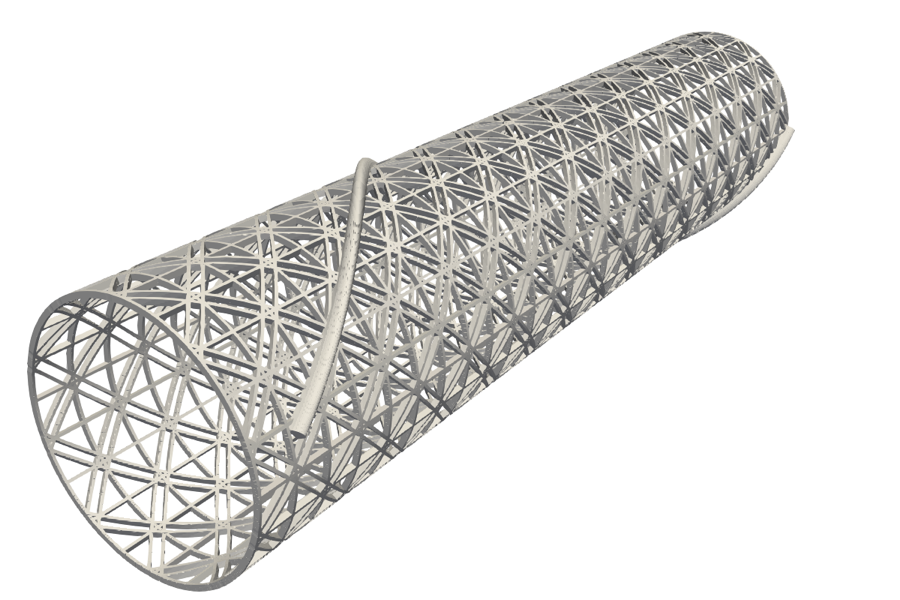

# Sponge geometry

[gen.py](gen.py) builds the sponge lattice (vertical beams,
circumferential beams, small double helices, large helices) and writes
`ver.stl`. It reads the parameters below from a `config.py` in the
current directory; `R`, `H` and `D_SHELIX` are fixed in `gen.py`.



Sponge with NV = 20, NC = 30, AA = 0.25, BB = 0.5, LOOP_NO = 1, R_E = 1.2,
NumBelix = 1, NumBelix2 = 0, rendered from `ver.stl` with
[vis.py](vis.py) (`pvpython vis.py`).

| Parameter | Description                                    | Range in mm  |
|-----------|------------------------------------------------|--------------|
| R         | Sponge radius                                  | 11           |
| H         | Sponge height                                  | 100          |
| D_SHELIX  | Spacing of small double helices                | 1.3          |
| NV        | Number of vertical beams                       | (20, 50)     |
| NC        | Number of circumferential beams                | (30, 74)     |
| AA        | Beam cross section height                      | (0.15, 0.65) |
| BB        | Beam cross section width (thickness)           | (0.15, 0.65) |
| LOOP_NO   | Number of big helix loops                      | (1, 6)       |
| R_E       | Radius of big helix major axis cross section   | (0.6, 1.6)   |
| NumBelix  | Number of clockwise big helices                | (0, 3)       |
| NumBelix2 | Number of counterclockwise big helices         | (0, 3)       |

Generate one directory per parameter combination and the STL files:

```
python3 run.py
for i in */; do (cd $i && PYTHONPATH=. python3 ../gen.py); done
```

Collect the STL files for ParaView:

```
for i in */ver.stl; do cp $i a.`dirname $i`.stl; done
```

Generate a Basilisk dump from one STL and check it in ParaView
([stl2dump.c](stl2dump.c) and [dump2xdmf.c](dump2xdmf.c) here are the
copies used by the cluster scripts; the maintained versions are in
[../dump](../dump)):

```
make
../stl/center.py ver.stl center.stl
./stl2dump -o -- -5 -6.25 -6.25 12.5  6 9  64 center.stl basilisk.dump
./dump2xdmf basilisk.dump basilisk
```

With walls at the sponge ends (`-w z LEVEL Z0 Z1`) and a run:

```
./stl2dump -v -w z 8 -2 2 -o -- -5 -6.25 -6.25 12.5  6 9  64 center.stl basilisk.dump
./dump2xdmf basilisk.dump basilisk
mpiexec -n 4 cylinder -v -r 2120 -l 6 -m 9 -p 10 -e 200 -f force -d basilisk.dump -o h -b pp
```

Cluster (SLURM) scripts: [batch.sh](batch.sh) fetches configurations
from `sponge-optimization-input`, [run.sh](run.sh) generates STL and
dump, [sim.sh](sim.sh) runs the solver, [0pre.sh](0pre.sh) and
[0run.sh](0run.sh) are the levels 10 13 versions with walls.
